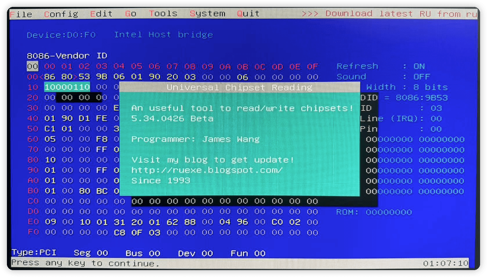
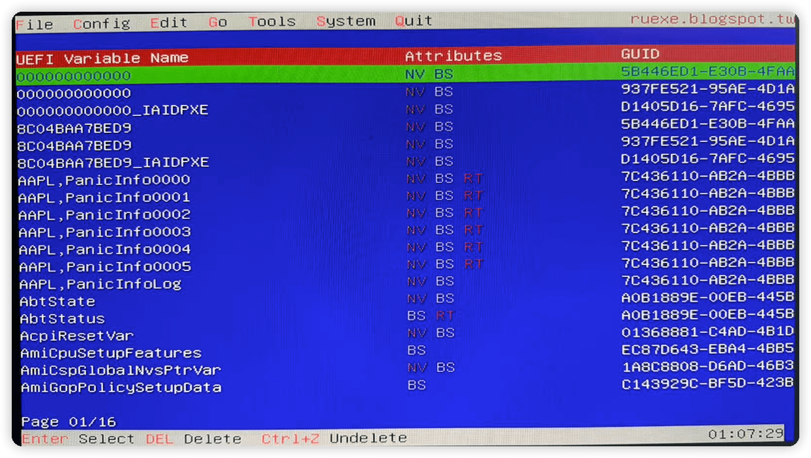
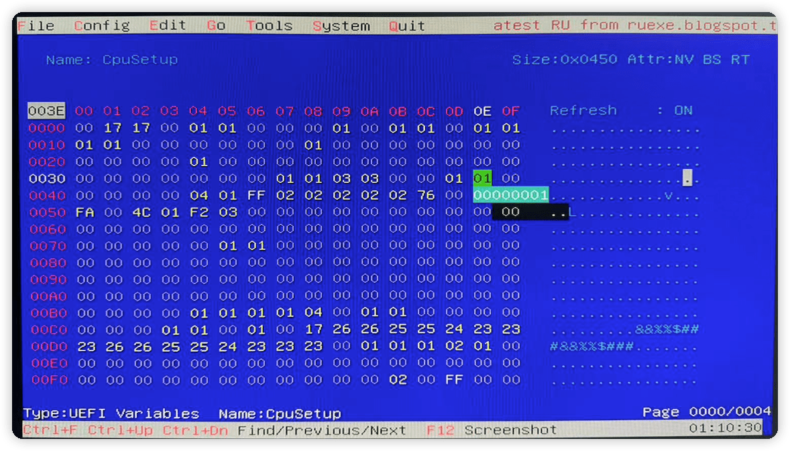
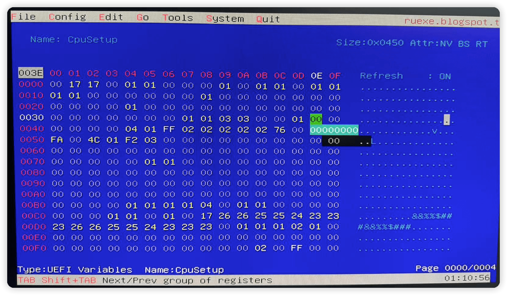
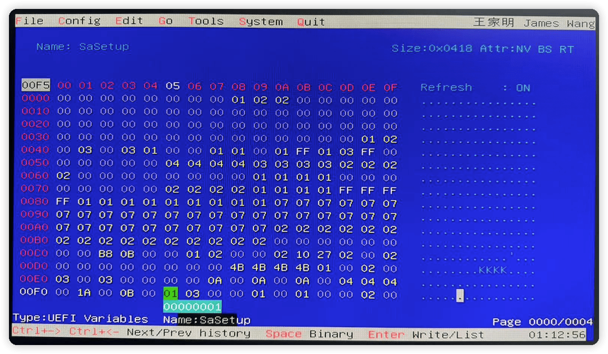
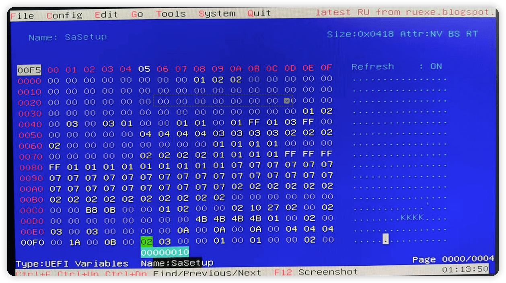

# 机器配置

* 型号: Dell 3080MFF
* BIOS: 0.21.31
* CPU：i5 10500T
* 内存：三星 16G 频率2666
* 主板：B460
* 网卡:  苹果拆机网卡`94360CS`
* 引导：OC 0.8.0
* 系统：Monterey 12.4

# BIOS设置

* System Configuration → SATA Operaition：AHCI
* Video → Primary Display：Intel HD Graphics
* Intel Software Guard Extension → Intel SGX Enable： Disabled
* Performance → Intel TurboBoost：勾选
* PowerManagement → Deep Sleep Control: Disabled. Block Sleep里面勾选 (我没有使用休眠功能) 
* DVMT和CFG LOCK 使用`Ru.efi`修改

# 完善度

* [x] CPU
    * [x] CPU变频,睿频
        * 通过`CPU-S`测试: 共7个变频档位. 最高3800MHz
    * [x] 风扇
        * 可以通过`Macs Fan Control`进行控制. 
* [x] 显卡
    * [x] HDMI 2K 正常
    * [x] DP接口 4K 正常
    * [ ] HDMI DP 双口同时使用(未测试)
* [x] 声音:
    * [x] 内置小喇叭
    * [x] 有线耳机 正常
    * [x] HDMI (通过HDMI接电视有声音)
* [x] 网络
    * [x] 有线
    * [x] Wifi 5G
    * [x] Wifi 2.4G 正常,但因为没有天线.信号强度??
    * [x] 蓝牙 正常 信号不太好,可能是天线接法问题
    * [x] AirDrop 能用,经常不能发现另外一台电脑
* [x] USB
    * [x] 前后USB3.0/2.0接口均正常
* [x] 系统相关
    * [x] Apple ID 正常登录 需要自己重新生成三码.
* [ ] 休眠 不支持

# CFG Lock 及 DVMT修改

* 使用"Clover Configurator"挂载U盘的EFI分区.
* 备份EFI分区的EFI目录. 并创建新的/EFI/BOOT目录.
* 将RU.efi拷贝到/EFI/BOOT目录并重命名为: bootx64.efi
* 重启计算机(按F12,然后选择U盘为第一启动项)

## FU.efi设置

Option   | UEFI Variable Name | Address | Default | Replace
---------|--------------------|---------|---------|---------
CFG LOCK | CPUSetup           | 0x3E    | 0x1     | 0x0
DVMT     | SaSetup            | 0xF5    | 0x0     | 0x2

1. 进入FU.efi后系统后按 ESC，“Alt” + “=” 进入菜单，”Ctrl“ + “F” 进入搜索；
2. 搜索 cpusetup，搜索两次，修改 Y 轴：0030 ；X 轴： 0E ，把默认值 01 修改为 00 ，回车确定，按 “Crtl” + “W” 保存修改；
3. 再次按“Alt” + “=” 进入菜单. ”Ctrl“ + “F” 搜索 sasetup，Y 轴：00F0 ；X 轴： 05，把默认值 01 修改为 02。按 “Crtl” + “W” 保存修改；
4. 按 “ALT” + Q 退出；
5. 重启再次进入软件界面确认修改完成。
6. 正常进行系统安装

### FU.efi 截图

* 进入初始界面

 

* Alt+= 进入的菜单

 

* CFG Lock

初始值:

 

修改后的值:

 

* 修改 `DVMT` 为 `64MB`  

初始值: 

 

修改后的值:

 

# 鸣谢及参考

* [黑果小兵](https://blog.daliansky.net/). 安装镜像使用的2022-05-17发布的: `macOS Monterey 12.4 21F79 Installer for OC/CLOVER/PE三分区原版镜像`
* [ifantasyw](https://github.com/ifantasyw/dell-3080mff-efi). 主要配置参考了这个网友,但是升级了OC到0.8.0,升级了驱动.并且添加了Dell风扇相关的驱动.
* [IT果农](https://www.imzhp.com/post/Dell-3080mff-OC-0.78-booter). BIOS设置及DVMT和CFG LOCK相关修改,参考了这位网友的文章.

